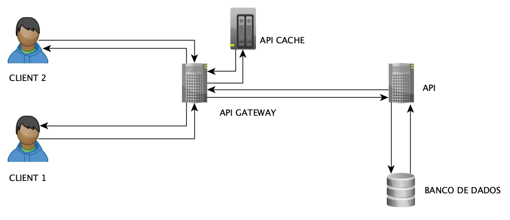

**Tecnologias**:
- **FastApi** - framework api rest
- **Uvicorn** - Asgi 
- **pydantic** - dto 
- **SqlAlchemy** - orm
- **Alambic** - migrates
- **DB** - mysql
- **Konda** - Api Gateway 
- **Redis** - Api cache
***
**Rotas**:
**Obras**
- [POST] https://url_api_gateway/obras/
- [GET] https://url_api_gateway/obras/<id_obra>
- [GET] https://url_api_gateway/obras/
- [PUT] https://url_api_gateway/obras/<id_obra>
- [DELETE] https://url_api_gateway/obras/<id_obra>
<br>

**Autores**
- [POST] https://url_api_gateway/autores/
- [GET] https://url_api_gateway/autores/<id_obra>
- [GET] https://url_api_gateway/autores/
- [PUT] https://url_api_gateway/autores/<id_obra>
- [DELETE] https://url_api_gateway/autores/<id_obra>
<br>

**Editoras**
- [POST] https://url_api_gateway/editoras/
- [GET] https://url_api_gateway/editoras/<id_obra>
- [GET] https://url_api_gateway/editoras/
- [PUT] https://url_api_gateway/editoras/<id_obra>
- [DELETE] https://url_api_gateway/editoras/<id_obra>
<br>

**Contrato:  Obras -> PUT ou POST**:
```json
{
	"titulo": "string",
	"editora_id": "int",
	"autores": "int"
}
```

**Contrato:  Autores -> PUT ou POST**:
```json
{
	"nome": "string"
}
```

**Contrato:  Editoras -> PUT ou POST**:
```json
{
	"nome": "string"
}
```
***
**Modelos**
- Obra
- Autor
- Editora
***
**Controles : Conversa com a camada de modelos e camada do banco**
- Obra
	- buscar todas
	- buscar especifica <id>
	- criar
	- editar <id>
	- deletar <id>
- Autor
	- buscar todas
	- buscar especifica <id>
	- criar
	- editar <id>
	- deletar <id>
- Editora
	- buscar todas
	- buscar especifica <id>
	- criar
	- editar <id>
	- deletar <id>

***
Infraestrutura

***
**Autenticação**
Vai ficar a cargo da API Gateway.
***